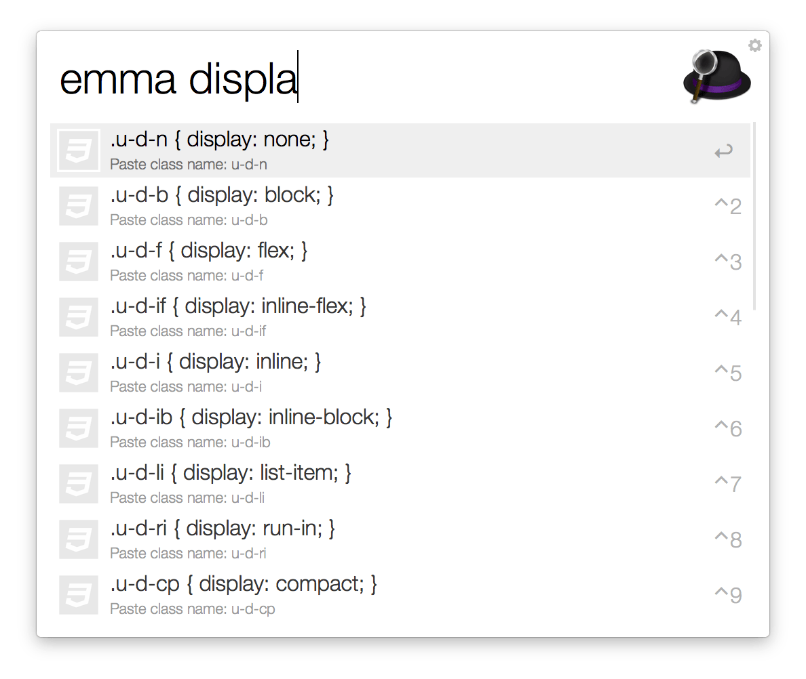

# Emma.css Workflow for Alfred

You can incremental search for [Emma.css](https://github.com/ruedap/emma.css) and paste it to front most app.

## Installation

Download **[Emma.alfredworkflow](https://github.com/ruedap/alfred-emma-css-workflow/raw/master/Emma.alfredworkflow)** and import to [Alfred 2](http://www.alfredapp.com/) (require Powerpack).

## License

Released under the [MIT license](http://ruedap.mit-license.org/2015).

## Author

